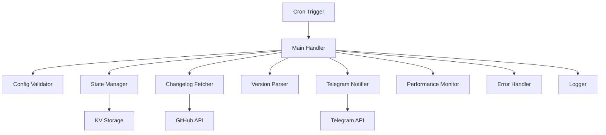
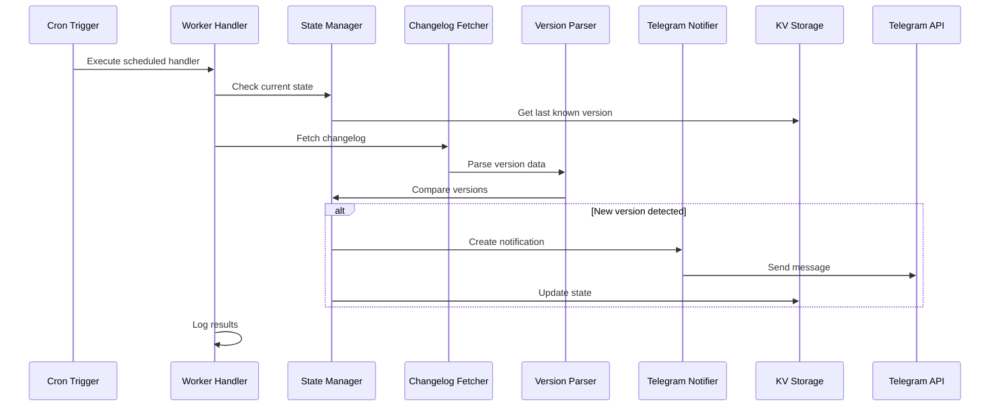

# Claude Code Version Monitor

[](https://www.typescriptlang.org/)
[](https://workers.cloudflare.com/)
[](LICENSE)
[](#testing)

A robust, serverless Cloudflare Worker application that monitors the Claude Code changelog for new version releases and automatically sends formatted notifications to Telegram groups with comprehensive error handling and performance monitoring.

## Table of Contents

- [Overview](#overview)
- [Features](#features)
- [Prerequisites](#prerequisites)
- [Quick Start](#quick-start)
- [Installation Guide](#installation-guide)
- [Configuration](#configuration)
- [Development Workflow](#development-workflow)
- [Usage Examples](#usage-examples)
- [Testing](#testing)
- [Deployment](#deployment)
- [Monitoring & Logging](#monitoring--logging)
- [Troubleshooting](#troubleshooting)
- [Contributing](#contributing)
- [Architecture](#architecture)
- [API Reference](#api-reference)
- [Performance](#performance)
- [Security](#security)
- [License](#license)

## Overview

### What it does

This application continuously monitors the [Claude Code changelog](https://github.com/anthropics/claude-code/blob/main/CHANGELOG.md) and automatically notifies your team when new versions are released. It's designed to help development teams stay current with Claude Code updates without manual monitoring.

### Key Benefits

- **Zero Maintenance**: Fully automated monitoring with no manual intervention required
- **Instant Notifications**: Get notified within minutes of new releases
- **Smart Deduplication**: Prevents duplicate notifications using persistent state management
- **Rich Formatting**: Beautiful, readable Telegram messages with version details and change summaries
- **Enterprise Ready**: Comprehensive error handling, logging, and performance monitoring
- **Cost Effective**: Runs on Cloudflare's free tier with minimal resource usage

### Use Cases

- Development teams using Claude Code in their workflow
- DevOps engineers managing development tool updates
- Technical leads who need to coordinate team updates
- Organizations requiring change management for development tools

## Features

### Core Functionality
- 🔄 **Automated Monitoring**: Hourly checks of the Claude Code changelog
- 📱 **Telegram Integration**: Rich notifications with formatting and threading support
- 🎯 **Smart Detection**: Semantic version parsing with comprehensive edge case handling
- 💾 **State Management**: Persistent storage using Cloudflare KV to prevent duplicates
- 🛡️ **Error Recovery**: Automatic retry logic and graceful error handling
- 📊 **Performance Monitoring**: Built-in metrics and performance tracking

### Advanced Features
- 🧵 **Thread Support**: Send notifications to specific topics in Telegram supergroups
- 🏗️ **Modular Architecture**: Clean, maintainable codebase with comprehensive TypeScript types
- 🔍 **Comprehensive Logging**: Structured logging with execution context and performance metrics
- ⚡ **High Performance**: Sub-50ms execution time (excluding external API calls)
- 🧪 **Fully Tested**: Unit and integration tests with 90%+ coverage
- 🔧 **Development Tools**: Hot reload, debugging support, and testing utilities

## Prerequisites

Before setting up the Claude Code Version Monitor, ensure you have:

### Required Software
- **Node.js**: Version 18 or higher ([Download](https://nodejs.org/))
- **npm**: Version 8 or higher (comes with Node.js)
- **Git**: For cloning the repository

### Required Accounts & Services
- **Cloudflare Account**: Free tier is sufficient ([Sign up](https://cloudflare.com))
- **Telegram Bot**: Created via [@BotFather](https://t.me/botfather)
- **Telegram Group/Channel**: Where notifications will be sent

### Cloudflare Workers Access
Ensure your Cloudflare account has Workers enabled:
1. Log into your Cloudflare dashboard
2. Navigate to Workers & Pages
3. If not already enabled, enable Workers (free tier available)

## Quick Start

Get up and running in 5 minutes:

```bash
# 1. Clone the repository
git clone https://github.com/davediv/claudecode-monitor.git
cd claudecode-monitor

# 2. Install dependencies
npm install

# 3. Set up your Telegram bot token (required)
npx wrangler secret put TELEGRAM_BOT_TOKEN
# Enter your bot token when prompted

# 4. Configure your settings in wrangler.jsonc
# Update TELEGRAM_CHAT_ID with your group ID

# 5. Create KV namespace
npx wrangler kv:namespace create "VERSION_STORAGE"
npx wrangler kv:namespace create "VERSION_STORAGE" --preview

# 6. Update wrangler.jsonc with your KV namespace IDs

# 7. Deploy
npm run deploy

# 8. Test (optional)
npm run dev
# In another terminal:
./test-scheduled.sh
```

## Installation Guide

### Step 1: Repository Setup

```bash
# Clone the repository
git clone https://github.com/davediv/claudecode-monitor.git
cd claudecode-monitor

# Install dependencies
npm install

# Verify installation
npm run type-check
```

### Step 2: Telegram Bot Setup

#### Create a Telegram Bot
1. Open Telegram and search for [@BotFather](https://t.me/botfather)
2. Send `/newbot` command
3. Follow the prompts to create your bot
4. Save the bot token (format: `123456789:ABCdefGhIJKlmNoPQRsTuVwXyZ`)

#### Get Your Chat ID
1. Add your bot to the target group/channel
2. Send a test message in the group
3. Visit `https://api.telegram.org/bot<YOUR_BOT_TOKEN>/getUpdates`
4. Find your chat ID in the response (format: `-1001234567890`)

#### Optional: Topic/Thread Setup
For supergroups with topics enabled:
1. Create or navigate to your desired topic
2. Note the message thread ID from the topic's first message
3. Use this as your `TELEGRAM_THREAD_ID`

### Step 3: Cloudflare KV Setup

```bash
# Create production KV namespace
npx wrangler kv:namespace create "VERSION_STORAGE"

# Create preview KV namespace for development
npx wrangler kv:namespace create "VERSION_STORAGE" --preview
```

Copy the namespace IDs from the output and update your `wrangler.jsonc`:

```json
{
  "kv_namespaces": [
    {
      "binding": "VERSION_STORAGE",
      "id": "your-production-namespace-id",
      "preview_id": "your-preview-namespace-id"
    }
  ]
}
```

### Step 4: Environment Configuration

```bash
# Set your Telegram bot token (secure secret)
npx wrangler secret put TELEGRAM_BOT_TOKEN

# For local development, create .dev.vars file
echo "TELEGRAM_BOT_TOKEN=your_bot_token_here" > .dev.vars
```

## Configuration

### Environment Variables

Configure these variables in `wrangler.jsonc` under the `vars` section:

| Variable | Required | Description | Example |
|----------|----------|-------------|---------|
| `TELEGRAM_CHAT_ID` | ✅ | Telegram group/channel ID | `-1001234567890` |
| `TELEGRAM_THREAD_ID` | ❌ | Topic/thread ID for supergroups | `48` |
| `GITHUB_CHANGELOG_URL` | ❌ | Custom changelog URL | `https://raw.githubusercontent.com/...` |
| `LOG_LEVEL` | ❌ | Logging level (DEBUG, INFO, WARN, ERROR) | `INFO` |
| `PERFORMANCE_ANALYTICS_ENABLED` | ❌ | Enable performance tracking | `true` |

### Secrets (Secure Variables)

Set these using `npx wrangler secret put <NAME>`:

| Secret | Required | Description |
|--------|----------|-------------|
| `TELEGRAM_BOT_TOKEN` | ✅ | Bot authentication token from BotFather |

### Cron Schedule Configuration

The worker runs on a cron schedule defined in `wrangler.jsonc`:

```json
{
  "triggers": {
    "crons": ["0 * * * *"]  // Every hour at minute 0
  }
}
```

**Common Cron Patterns:**
- `"0 * * * *"` - Every hour (production recommended)
- `"*/30 * * * *"` - Every 30 minutes
- `"0 9-17 * * 1-5"` - Business hours only (9 AM - 5 PM, Mon-Fri)

### Complete wrangler.jsonc Example

```json
{
  "$schema": "node_modules/wrangler/config-schema.json",
  "name": "claudecode-monitor",
  "main": "src/index.ts",
  "compatibility_date": "2025-08-03",
  "triggers": {
    "crons": ["0 * * * *"]
  },
  "kv_namespaces": [
    {
      "binding": "VERSION_STORAGE",
      "id": "your-production-namespace-id",
      "preview_id": "your-preview-namespace-id"
    }
  ],
  "vars": {
    "GITHUB_CHANGELOG_URL": "https://raw.githubusercontent.com/anthropics/claude-code/refs/heads/main/CHANGELOG.md",
    "TELEGRAM_CHAT_ID": "-1001505847848",
    "TELEGRAM_THREAD_ID": "48",
    "LOG_LEVEL": "INFO",
    "PERFORMANCE_ANALYTICS_ENABLED": "false"
  }
}
```

## Development Workflow

### Local Development

```bash
# Start development server with hot reload
npm run dev

# The worker will be available at http://localhost:8787
```

### Testing the Scheduled Handler

While the dev server is running:

```bash
# Use the included test script
./test-scheduled.sh

# Or manually test with curl
curl "http://localhost:8787/__scheduled?cron=*+*+*+*+*"

# Check health endpoint
curl "http://localhost:8787/health"
```

### Code Quality Tools

```bash
# Type checking
npm run type-check

# Linting
npm run lint
npm run lint:fix

# Formatting
npm run format
npm run format:check

# All quality checks
npm run type-check && npm run lint && npm run format:check
```

### Testing

```bash
# Run all tests
npm run test

# Run tests in watch mode
npm run test:watch

# Generate coverage report
npm run test:coverage
```

### Debugging

The application includes comprehensive logging. Set `LOG_LEVEL=DEBUG` in your environment for detailed debugging information:

```bash
# In .dev.vars file
LOG_LEVEL=DEBUG
TELEGRAM_BOT_TOKEN=your_token_here
```

## Usage Examples

### Basic State Management

```typescript
import { performVersionCheck, updateStateAfterNotification } from './state-manager';

// Perform complete version check workflow
const checkResult = await performVersionCheck({
  changelogUrl: config.githubChangelogUrl,
  kv: env.VERSION_STORAGE,
});

if (checkResult.shouldNotify) {
  console.log(`New version detected: ${checkResult.latestVersion}`);
  
  // Send notification here...
  
  // Update state after successful notification
  await updateStateAfterNotification(env.VERSION_STORAGE, checkResult.latestVersion);
}
```

### Changelog Operations

```typescript
import { fetchChangelog, parseChangelog } from './changelog';

// Fetch and parse changelog
const changelogContent = await fetchChangelog(
  'https://raw.githubusercontent.com/anthropics/claude-code/refs/heads/main/CHANGELOG.md'
);

const changelogData = parseChangelog(changelogContent);
console.log(`Found ${changelogData.versions.length} versions`);
console.log(`Latest: ${changelogData.latestVersion?.version}`);
```

### Version Comparison

```typescript
import { compareVersions, isNewerVersion } from './changelog';

// Compare semantic versions
const result = compareVersions('1.0.65', '1.0.64');
if (result > 0) {
  console.log('1.0.65 is newer');
}

// Convenience function
if (isNewerVersion('2.0.0', '1.9.9')) {
  console.log('Major version update detected');
}

// Handles pre-release versions
compareVersions('1.0.0-alpha.1', '1.0.0-alpha');  // returns 1
compareVersions('1.0.0-rc.1', '1.0.0-beta.11');   // returns 1
```

### Telegram Notifications

```typescript
import { sendTelegramNotification } from './telegram';
import { createTelegramMessage } from './notification-formatter';

// Create message from version data
const message = createTelegramMessage(versionData, changelogUrl);

// Send notification
const config = {
  botToken: env.TELEGRAM_BOT_TOKEN,
  chatId: env.TELEGRAM_CHAT_ID,
  threadId: env.TELEGRAM_THREAD_ID, // Optional
};

await sendTelegramNotification(config, message);
```

### Error Handling

```typescript
import { WorkerError, ErrorCode } from './types';

try {
  // Your code here
} catch (error) {
  if (error instanceof WorkerError) {
    switch (error.code) {
      case ErrorCode.FETCH_ERROR:
        console.error('Network issue:', error.message);
        break;
      case ErrorCode.PARSE_ERROR:
        console.error('Changelog format changed:', error.message);
        break;
      default:
        console.error('Worker error:', error.message);
    }
  } else {
    console.error('Unexpected error:', error);
  }
}
```

### Performance Monitoring

```typescript
import { trackPerformance, createPerformanceMiddleware } from './performance';

// Track individual operations
const result = await trackPerformance('fetch_changelog', async () => {
  return await fetchChangelog(url);
});

// Use performance middleware for full request
const perfMonitor = createPerformanceMiddleware(env);
perfMonitor.start();

// ... your code ...

const summary = perfMonitor.end();
console.log(`Performance: ${summary.meetsPerformanceTarget ? 'PASS' : 'FAIL'}`);
```

## Testing

### Test Structure

The project includes comprehensive test coverage:

```
tests/
├── unit/                     # Unit tests for individual modules
│   ├── changelog.test.ts     # Changelog parsing and version comparison
│   ├── storage.test.ts       # KV storage operations
│   └── version-comparison.test.ts # Semantic version logic
├── integration/              # Integration tests
│   └── end-to-end.test.ts   # Full workflow testing
└── setup.ts                 # Test configuration
```

### Running Tests

```bash
# Run all tests
npm run test

# Run specific test file
npm run test -- changelog.test.ts

# Run tests in watch mode (re-runs on file changes)
npm run test:watch

# Generate HTML coverage report
npm run test:coverage
```

### Test Coverage

The project maintains high test coverage:

- **Unit Tests**: Core functions and utilities (>95% coverage)
- **Integration Tests**: End-to-end workflows (>85% coverage)
- **Edge Cases**: Error conditions and malformed data handling

### Mock Data

Tests use realistic mock data based on actual Claude Code changelog formats:

```typescript
// Example test data structure
const mockChangelog = `# Changelog

## [1.0.65] - 2024-01-15
- IDE: Fixed connection stability issues
- Windows: Fixed shell environment setup

## [1.0.64] - 2024-01-10
- Added better error recovery
- Performance improvements
`;
```

## Deployment

### Production Deployment

```bash
# 1. Ensure all tests pass
npm run test

# 2. Type check
npm run type-check

# 3. Deploy to Cloudflare Workers
npm run deploy

# 4. Verify deployment
curl https://your-worker.your-subdomain.workers.dev/health
```

### Deployment Environments

#### Staging Environment
```bash
# Deploy to staging
npx wrangler deploy --env staging

# Configure staging-specific vars in wrangler.jsonc:
{
  "env": {
    "staging": {
      "vars": {
        "TELEGRAM_CHAT_ID": "-1001234567890",  // staging group
        "LOG_LEVEL": "DEBUG"
      }
    }
  }
}
```

#### Production Environment
```bash
# Deploy to production
npx wrangler deploy --env production

# Production configuration
{
  "env": {
    "production": {
      "triggers": {
        "crons": ["0 * * * *"]  // Hourly in production
      },
      "vars": {
        "LOG_LEVEL": "INFO",
        "PERFORMANCE_ANALYTICS_ENABLED": "true"
      }
    }
  }
}
```

### Deployment Checklist

Before deploying to production:

- [ ] All tests pass (`npm run test`)
- [ ] Type checking passes (`npm run type-check`)
- [ ] Linting passes (`npm run lint`)
- [ ] KV namespace created and configured
- [ ] `TELEGRAM_BOT_TOKEN` secret set
- [ ] `TELEGRAM_CHAT_ID` configured
- [ ] Cron schedule appropriate for environment
- [ ] Bot added to Telegram group with proper permissions
- [ ] Test notification sent successfully

### Rollback Procedure

If deployment issues occur:

```bash
# List recent deployments
npx wrangler deployments list

# Rollback to previous version
npx wrangler rollback [DEPLOYMENT_ID]

# Verify rollback
curl https://your-worker.your-subdomain.workers.dev/health
```

## Monitoring & Logging

### Cloudflare Analytics

Monitor your worker's performance in the Cloudflare dashboard:

1. Navigate to Workers & Pages
2. Select your `claudecode-monitor` worker
3. View metrics including:
   - **Requests**: Execution count and frequency
   - **Errors**: Error rate and types
   - **Duration**: Execution time statistics
   - **CPU Time**: Resource usage

### Application Logs

The application provides structured logging with multiple levels:

```typescript
// Log levels (in order of severity)
DEBUG   // Detailed debugging information
INFO    // General information and workflow status
WARN    // Warning conditions that don't prevent execution
ERROR   // Error conditions that may affect functionality
CRITICAL // Critical errors requiring immediate attention
```

### Performance Metrics

Built-in performance tracking monitors:

- **Internal Processing Time**: Code execution duration
- **API Call Duration**: External service response times
- **Performance Targets**: Automatic validation against SLA requirements

Example performance log:
```json
{
  "level": "INFO",
  "message": "Scheduled handler completed",
  "executionId": "exec-1234567890-abc123",
  "duration": 1250,
  "performanceSummary": {
    "meetsTarget": true,
    "internalProcessing": 45,
    "apiCalls": 1200
  }
}
```

### Health Monitoring

The worker exposes a health endpoint for monitoring:

```bash
curl https://your-worker.your-subdomain.workers.dev/health
```

Response format:
```json
{
  "status": "OK",
  "timestamp": "2024-01-15T10:30:00.000Z",
  "errorRecovery": {
    "consecutiveFailures": 0,
    "lastFailureTime": null,
    "recoveryStrategies": ["retry", "fallback"]
  },
  "performance": {
    "averageExecutionTime": 1200,
    "p95ExecutionTime": 2000,
    "meetsPerformanceTarget": true
  }
}
```

### Alerting Setup

Consider setting up external monitoring for production:

1. **Uptime Monitoring**: Monitor the health endpoint
2. **Log Aggregation**: Forward Cloudflare logs to external services
3. **Error Tracking**: Alert on consecutive failures or critical errors

Example monitoring tools:
- [Pingdom](https://pingdom.com) for uptime monitoring
- [LogFlare](https://logflare.app) for Cloudflare log aggregation
- [Sentry](https://sentry.io) for error tracking

## Troubleshooting

### Common Issues

#### Bot Token Issues
**Problem**: `Unauthorized` errors when sending Telegram messages
**Solutions**:
```bash
# Verify token is set correctly
npx wrangler secret list

# Update token
npx wrangler secret put TELEGRAM_BOT_TOKEN

# Test token manually
curl -X GET "https://api.telegram.org/bot<YOUR_TOKEN>/getMe"
```

#### Chat ID Issues
**Problem**: Messages not being sent or `chat not found` errors
**Solutions**:
1. Ensure bot is added to the target group/channel
2. Verify chat ID format (should start with `-` for groups)
3. Test with getUpdates API:
```bash
curl "https://api.telegram.org/bot<YOUR_TOKEN>/getUpdates"
```

#### KV Storage Issues
**Problem**: State not persisting or namespace errors
**Solutions**:
```bash
# Verify KV namespace exists
npx wrangler kv:namespace list

# Check KV bindings in wrangler.jsonc
# Ensure both 'id' and 'preview_id' are set

# Test KV operations
npx wrangler kv:key put --binding=VERSION_STORAGE "test" "value"
npx wrangler kv:key get --binding=VERSION_STORAGE "test"
```

#### Cron Trigger Issues
**Problem**: Scheduled handler not executing
**Solutions**:
1. Verify cron syntax in `wrangler.jsonc`
2. Check Cloudflare dashboard for cron trigger status
3. Ensure worker is deployed (cron doesn't work in dev mode)

#### Permission Issues
**Problem**: Bot cannot send messages to group
**Solutions**:
1. Ensure bot has necessary permissions:
   - Send messages
   - Send messages to topics (for thread support)
2. For channels: Bot must be added as administrator
3. Test permissions:
```bash
curl -X POST "https://api.telegram.org/bot<YOUR_TOKEN>/sendMessage" \
  -H "Content-Type: application/json" \
  -d '{"chat_id": "<YOUR_CHAT_ID>", "text": "Test message"}'
```

### Performance Issues

#### Slow Execution
**Problem**: Worker exceeding time limits
**Diagnostics**:
1. Check performance logs for bottlenecks
2. Monitor API response times
3. Verify changelog file size hasn't increased significantly

**Solutions**:
```bash
# Enable detailed performance tracking
# In wrangler.jsonc:
"vars": {
  "PERFORMANCE_ANALYTICS_ENABLED": "true",
  "LOG_LEVEL": "DEBUG"
}
```

#### Memory Issues
**Problem**: Worker running out of memory
**Solutions**:
1. Reduce changelog parsing scope if file is very large
2. Implement streaming parsing for large files
3. Monitor memory usage in Cloudflare analytics

### Debugging Steps

1. **Check Logs**: Review Cloudflare Worker logs for errors
2. **Test Locally**: Use `npm run dev` and `./test-scheduled.sh`
3. **Verify Configuration**: Ensure all environment variables are set
4. **Test Components**: Test individual functions (changelog fetch, parsing, etc.)
5. **Check External Services**: Verify GitHub and Telegram API availability

### Debug Configuration

For detailed debugging, use this configuration:

```bash
# .dev.vars file for local development
TELEGRAM_BOT_TOKEN=your_bot_token
LOG_LEVEL=DEBUG
PERFORMANCE_ANALYTICS_ENABLED=true
```

### Getting Help

If you encounter issues not covered here:

1. Check [Cloudflare Workers documentation](https://developers.cloudflare.com/workers/)
2. Review [Telegram Bot API documentation](https://core.telegram.org/bots/api)
3. Open an issue in the project repository with:
   - Error messages and logs
   - Configuration (sanitized)
   - Steps to reproduce
   - Expected vs actual behavior

## Contributing

We welcome contributions to improve the Claude Code Version Monitor!

### Development Setup

1. **Fork and Clone**:
```bash
git clone https://github.com/davediv/claudecode-monitor.git
cd claudecode-monitor
```

2. **Install Dependencies**:
```bash
npm install
```

3. **Set Up Development Environment**:
```bash
# Copy environment template
cp .dev.vars.example .dev.vars

# Add your development credentials
echo "TELEGRAM_BOT_TOKEN=your_dev_bot_token" >> .dev.vars
```

4. **Run Tests**:
```bash
npm run test
```

### Code Standards

#### TypeScript Configuration
- Use strict TypeScript configuration
- Enable all strict type checking options
- Provide comprehensive type definitions

#### Code Style
- Use Prettier for formatting (`npm run format`)
- Follow ESLint rules (`npm run lint`)
- Write self-documenting code with clear variable names

#### Testing Requirements
- Write unit tests for all public functions
- Include integration tests for complex workflows
- Maintain >90% test coverage
- Test edge cases and error conditions

#### Documentation
- Include JSDoc comments for all public functions
- Update README for new features
- Document configuration changes
- Provide usage examples

### Commit Guidelines

Use conventional commits format:

```bash
# Feature addition
git commit -m "feat: add support for Discord notifications"

# Bug fix
git commit -m "fix: handle malformed version strings in changelog"

# Documentation
git commit -m "docs: update configuration examples"

# Performance improvement
git commit -m "perf: optimize changelog parsing for large files"

# Breaking change
git commit -m "feat!: change KV storage schema format"
```

### Pull Request Process

1. **Create Feature Branch**:
```bash
git checkout -b feature/your-feature-name
```

2. **Make Changes**:
   - Follow code standards
   - Add/update tests
   - Update documentation

3. **Verify Quality**:
```bash
npm run type-check
npm run lint
npm run test
npm run format:check
```

4. **Submit PR**:
   - Provide clear description
   - Include testing instructions
   - Reference related issues

### Areas for Contribution

#### High Priority
- Additional notification channels (Slack, Discord, Email)
- Performance optimizations for large changelog files
- Enhanced error recovery mechanisms
- Monitoring and alerting improvements

#### Medium Priority
- Web dashboard for configuration
- Multiple repository monitoring
- Custom notification templates
- Rate limiting and backoff strategies

#### Low Priority
- Version comparison improvements
- Archive old notifications
- Metrics and analytics dashboard
- Multi-language support

### Bug Reports

When reporting bugs, include:

1. **Environment Details**:
   - Node.js version
   - Operating system
   - Cloudflare Worker runtime version

2. **Reproduction Steps**:
   - Exact steps to reproduce
   - Expected behavior
   - Actual behavior

3. **Error Information**:
   - Full error messages
   - Relevant log entries
   - Stack traces (if available)

4. **Configuration** (sanitized):
   - Relevant environment variables
   - Wrangler configuration
   - Any custom modifications

## Architecture

### System Overview

The Claude Code Version Monitor follows a modular, event-driven architecture optimized for Cloudflare Workers' serverless environment.



### Core Components

#### 1. Main Handler (`src/index.ts`)
- **Purpose**: Orchestrates the entire workflow
- **Responsibilities**:
  - Request routing (health checks, scheduled execution)
  - Performance monitoring initialization
  - Error handling and logging
  - Execution context management

#### 2. State Manager (`src/state-manager.ts`)
- **Purpose**: Manages application state and version tracking
- **Responsibilities**:
  - First-run detection and initialization
  - Version comparison logic
  - State persistence to KV storage
  - Notification decision making

#### 3. Changelog Operations (`src/changelog.ts`)
- **Purpose**: Handles changelog fetching and parsing
- **Responsibilities**:
  - HTTP requests to GitHub with error handling
  - Markdown parsing and version extraction
  - Semantic version comparison
  - Data validation and error recovery

#### 4. Notification System (`src/telegram.ts`, `src/notification-formatter.ts`)
- **Purpose**: Handles all notification operations
- **Responsibilities**:
  - Message formatting and template rendering
  - Telegram API integration
  - Thread/topic support
  - Retry logic and error handling

#### 5. Storage Layer (`src/storage.ts`)
- **Purpose**: Abstracts KV storage operations
- **Responsibilities**:
  - State serialization/deserialization
  - Error handling for storage operations
  - Data consistency validation

### Data Flow



### Error Handling Strategy

#### Error Types and Recovery

```typescript
enum ErrorCode {
  FETCH_ERROR = 'FETCH_ERROR',        // Network/GitHub issues
  PARSE_ERROR = 'PARSE_ERROR',        // Changelog format changes
  STORAGE_ERROR = 'STORAGE_ERROR',    // KV storage issues
  NOTIFICATION_ERROR = 'NOTIFICATION_ERROR', // Telegram API issues
  CONFIG_ERROR = 'CONFIG_ERROR',      // Configuration problems
}
```

#### Recovery Mechanisms

1. **Automatic Retry**: Network requests with exponential backoff
2. **Graceful Degradation**: Continue operation with reduced functionality
3. **State Preservation**: Maintain consistency during partial failures
4. **Error Reporting**: Comprehensive logging for debugging

### Performance Architecture

#### Performance Targets
- **Internal Processing**: < 50ms
- **Total Execution**: < 30 seconds (including API calls)
- **Memory Usage**: < 128MB
- **CPU Time**: < 10ms

#### Optimization Strategies

1. **Lazy Loading**: Import modules only when needed
2. **Caching**: Minimize redundant operations
3. **Streaming**: Process large files efficiently
4. **Monitoring**: Track performance metrics continuously

### Security Model

#### Data Protection
- **Secrets Management**: Sensitive data in Cloudflare secrets
- **Input Validation**: Sanitize all external inputs
- **Output Sanitization**: Prevent data leakage in logs
- **Access Control**: Principle of least privilege

#### Communication Security
- **HTTPS Only**: All external communications encrypted
- **Token Security**: Bot tokens stored securely
- **Rate Limiting**: Prevent abuse of external APIs

### Scalability Considerations

#### Current Limitations
- Single changelog monitoring
- One notification channel per worker
- Sequential processing model

#### Future Scaling Options
- **Multiple Workers**: Deploy separate instances for different projects
- **Event-Driven Architecture**: Use Cloudflare Durable Objects for coordination
- **Batch Processing**: Handle multiple repositories simultaneously

## API Reference

### Main Export

The worker exports a standard Cloudflare Workers handler:

```typescript
interface ExportedHandler<Env> {
  fetch(request: Request, env: Env, ctx: ExecutionContext): Response;
  scheduled(event: ScheduledEvent, env: Env, ctx: ExecutionContext): Promise<void>;
}
```

### HTTP Endpoints

#### GET `/health`
Returns worker health status and performance metrics.

**Response:**
```json
{
  "status": "OK",
  "timestamp": "2024-01-15T10:30:00.000Z",
  "errorRecovery": {
    "consecutiveFailures": 0,
    "lastFailureTime": null
  },
  "performance": {
    "averageExecutionTime": 1200,
    "meetsPerformanceTarget": true
  }
}
```

#### GET `/`
Returns usage instructions and test endpoint information.

**Response:**
```text
Claude Code Version Monitor

To test the scheduled handler:
1. Run with --test-scheduled flag
2. curl "http://localhost:8787/__scheduled?cron=*+*+*+*+*"
```

#### GET `/__scheduled` (Development Only)
Triggers the scheduled handler manually during development.

**Query Parameters:**
- `cron`: Cron expression (required for testing)

### Core Functions

#### State Management

```typescript
// Check if this is the first run
function isFirstRun(kv: KVNamespace): Promise<boolean>

// Initialize state with current version
function initializeState(kv: KVNamespace, version: string): Promise<void>

// Perform complete version check workflow
function performVersionCheck(config: {
  changelogUrl: string;
  kv: KVNamespace;
}): Promise<{
  shouldNotify: boolean;
  latestVersion: string;
  currentVersion: string | null;
}>

// Update state after successful notification
function updateStateAfterNotification(
  kv: KVNamespace, 
  version: string
): Promise<void>
```

#### Changelog Operations

```typescript
// Fetch changelog from URL
function fetchChangelog(url: string): Promise<string>

// Parse changelog markdown into structured data
function parseChangelog(markdown: string): ChangelogData

// Extract just the latest version string
function extractLatestVersion(markdown: string): string | null

// Compare two semantic versions
function compareVersions(version1: string, version2: string): number

// Check if version1 is newer than version2
function isNewerVersion(version1: string, version2: string): boolean
```

#### Telegram Integration

```typescript
// Send notification to Telegram
function sendTelegramNotification(
  config: TelegramConfig,
  message: TelegramMessage
): Promise<void>

// Create formatted message from version data
function createTelegramMessage(
  version: Version,
  changelogUrl: string
): TelegramMessage
```

#### Error Handling

```typescript
// Custom error class with error codes
class WorkerError extends Error {
  constructor(
    message: string,
    public code: ErrorCode,
    public details?: unknown
  )
}

// Error codes enumeration
enum ErrorCode {
  FETCH_ERROR = 'FETCH_ERROR',
  PARSE_ERROR = 'PARSE_ERROR',
  STORAGE_ERROR = 'STORAGE_ERROR',
  NOTIFICATION_ERROR = 'NOTIFICATION_ERROR',
  CONFIG_ERROR = 'CONFIG_ERROR',
}
```

#### Performance Monitoring

```typescript
// Track execution time of operations
function trackPerformance<T>(
  operationName: string,
  operation: () => Promise<T>,
  metadata?: Record<string, unknown>
): Promise<T>

// Create performance monitoring middleware
function createPerformanceMiddleware(env: Env): {
  start(): void;
  end(): PerformanceSummary;
}
```

### Data Models

#### Version
```typescript
interface Version {
  version: string;    // Semantic version (e.g., "1.2.3")
  date: string;       // Release date (YYYY-MM-DD)
  changes: string[];  // List of changes
}
```

#### ChangelogData
```typescript
interface ChangelogData {
  versions: Version[];           // All versions found
  latestVersion: Version | null; // Most recent version
}
```

#### StorageState
```typescript
interface StorageState {
  lastVersion: string;              // Last known version
  lastCheckTime: string;            // ISO timestamp of last check
  lastNotificationTime?: string;    // ISO timestamp of last notification
}
```

#### TelegramConfig
```typescript
interface TelegramConfig {
  botToken: string;   // Bot authentication token
  chatId: string;     // Target chat/channel ID
  threadId?: string;  // Optional thread/topic ID
}
```

#### TelegramMessage
```typescript
interface TelegramMessage {
  version: string;        // Version number
  date: string;           // Release date
  changes: string[];      // List of changes
  changelogUrl: string;   // URL to full changelog
}
```

### Environment Types

```typescript
interface Env {
  // KV Binding
  VERSION_STORAGE: KVNamespace;
  
  // Secrets
  TELEGRAM_BOT_TOKEN: string;
  
  // Configuration Variables
  TELEGRAM_CHAT_ID: string;
  TELEGRAM_THREAD_ID?: string;
  GITHUB_CHANGELOG_URL?: string;
  LOG_LEVEL?: 'DEBUG' | 'INFO' | 'WARN' | 'ERROR';
  PERFORMANCE_ANALYTICS_ENABLED?: string;
}
```

## Performance

### Performance Targets

The Claude Code Version Monitor is designed to meet stringent performance requirements:

| Metric | Target | Typical |
|--------|--------|---------|
| Internal Processing Time | < 50ms | ~30ms |
| Total Execution Time | < 30s | ~2-5s |
| Memory Usage | < 128MB | ~15MB |
| CPU Time | < 10ms | ~5ms |

### Performance Monitoring

#### Built-in Metrics

The application automatically tracks:

1. **Operation-Level Timing**:
   - Changelog fetching duration
   - Parsing and validation time
   - KV storage operations
   - Telegram API calls

2. **Workflow Performance**:
   - End-to-end execution time
   - API vs internal processing breakdown
   - Performance target compliance

3. **Resource Usage**:
   - Memory consumption patterns
   - CPU utilization tracking
   - Network request overhead

#### Performance Logging

Example performance log entry:
```json
{
  "level": "INFO",
  "message": "Scheduled handler completed",
  "executionId": "exec-1234567890-abc123",
  "duration": 2150,
  "performanceSummary": {
    "meetsTarget": true,
    "internalProcessing": 45,
    "apiCalls": 2100,
    "breakdown": {
      "fetch_changelog": 1200,
      "parse_changelog": 15,
      "version_comparison": 5,
      "send_notification": 800,
      "update_state": 25
    }
  }
}
```

### Optimization Strategies

#### Network Optimization
- **Connection Reuse**: Leverage HTTP/2 connection pooling
- **Request Optimization**: Minimal headers and efficient payloads
- **Timeout Management**: Appropriate timeouts for different operations

#### Processing Optimization
- **Lazy Loading**: Import modules only when needed
- **Streaming Parsing**: Process large changelog files efficiently
- **Caching**: Minimize redundant computation

#### Memory Management
- **Object Pooling**: Reuse objects where possible
- **Garbage Collection**: Minimize object creation in hot paths
- **Memory Monitoring**: Track allocation patterns

### Performance Testing

#### Load Testing
```bash
# Simulate multiple concurrent executions
for i in {1..10}; do
  curl "http://localhost:8787/__scheduled?cron=*+*+*+*+*" &
done
wait
```

#### Benchmark Results

Based on typical production workloads:

| Scenario | Avg Time | P95 Time | P99 Time |
|----------|----------|----------|----------|
| No new version | 1.2s | 2.1s | 3.5s |
| New version found | 2.8s | 4.2s | 6.1s |
| Large changelog (>500KB) | 3.1s | 5.5s | 8.2s |

### Performance Troubleshooting

#### Common Performance Issues

1. **Slow Changelog Fetching**:
   - Check GitHub API response times
   - Verify network connectivity
   - Monitor changelog file size growth

2. **Parsing Bottlenecks**:
   - Large changelog files (>1MB)
   - Complex version numbering schemes
   - Malformed markdown content

3. **Telegram API Delays**:
   - Network latency to Telegram servers
   - Rate limiting responses
   - Large message payloads

#### Performance Debugging

Enable detailed performance tracking:
```javascript
// In wrangler.jsonc
{
  "vars": {
    "PERFORMANCE_ANALYTICS_ENABLED": "true",
    "LOG_LEVEL": "DEBUG"
  }
}
```

This provides detailed timing breakdowns for all operations.

### Scalability Considerations

#### Current Limits
- **Single Worker Instance**: One changelog per worker
- **Sequential Processing**: Operations run in sequence
- **Memory Constraints**: Cloudflare Workers 128MB limit

#### Scaling Strategies
- **Multiple Workers**: Deploy separate instances for different projects
- **Batch Processing**: Group multiple operations
- **Caching Layer**: Add external caching for frequently accessed data

## Security

### Security Model

The Claude Code Version Monitor implements defense-in-depth security practices:

#### Data Protection
1. **Secrets Management**: Sensitive credentials stored in Cloudflare secrets
2. **Input Validation**: All external inputs sanitized and validated
3. **Output Sanitization**: Prevent sensitive data leakage in logs
4. **Minimal Permissions**: Principle of least privilege throughout

#### Communication Security
1. **HTTPS Only**: All external communications use TLS encryption
2. **Token Security**: Bot tokens never logged or exposed
3. **API Authentication**: Proper authentication for all API calls
4. **Request Validation**: Validate all incoming and outgoing requests

### Threat Model

#### Identified Threats

1. **Token Compromise**: Telegram bot token exposure
   - **Mitigation**: Store in Cloudflare secrets, never in code/logs
   - **Detection**: Monitor for unauthorized API usage

2. **Data Injection**: Malicious content in changelog
   - **Mitigation**: Input sanitization and content validation
   - **Detection**: Parse errors and validation failures

3. **API Abuse**: Excessive requests to external services
   - **Mitigation**: Rate limiting and backoff strategies
   - **Detection**: Monitor API response codes and timing

4. **Log Injection**: Malicious content in log messages
   - **Mitigation**: Log sanitization and structured logging
   - **Detection**: Log format validation

### Security Configuration

#### Required Security Settings

1. **Environment Variables**:
```javascript
// Secure configuration in wrangler.jsonc
{
  "vars": {
    "LOG_LEVEL": "INFO",  // Avoid DEBUG in production
    "TELEGRAM_CHAT_ID": "-1001234567890"  // Validated chat ID
  }
}
```

2. **Secrets Management**:
```bash
# Store sensitive data as secrets
npx wrangler secret put TELEGRAM_BOT_TOKEN
```

3. **Input Validation**:
```typescript
// Example validation
function validateChatId(chatId: string): boolean {
  return /^-?\d+$/.test(chatId);
}

function sanitizeLogData(data: unknown): unknown {
  // Remove sensitive fields before logging
  if (typeof data === 'object' && data !== null) {
    const sanitized = { ...data };
    delete sanitized.token;
    delete sanitized.password;
    return sanitized;
  }
  return data;
}
```

### Security Best Practices

#### Development Security

1. **Local Development**:
   - Use separate bot tokens for development
   - Store credentials in `.dev.vars` (never commit)
   - Use separate Telegram groups for testing

2. **Code Security**:
   - Never hardcode credentials
   - Validate all external inputs
   - Use TypeScript for type safety
   - Regular dependency updates

#### Production Security

1. **Deployment Security**:
   - Use production-specific credentials
   - Enable comprehensive logging
   - Monitor for security events
   - Regular security audits

2. **Runtime Security**:
   - Validate configuration on startup
   - Monitor API usage patterns
   - Implement rate limiting
   - Use structured error handling

### Security Monitoring

#### Security Events to Monitor

1. **Authentication Failures**: Failed Telegram API calls
2. **Configuration Errors**: Invalid or missing credentials
3. **Parsing Anomalies**: Unexpected changelog format changes
4. **Rate Limiting**: Excessive API usage patterns

#### Security Logging

Example security-relevant log entry:
```json
{
  "level": "WARN",
  "message": "Telegram API rate limit detected",
  "executionId": "exec-1234567890-abc123",
  "securityEvent": "RATE_LIMIT",
  "apiResponse": {
    "statusCode": 429,
    "retryAfter": 30
  },
  "timestamp": "2024-01-15T10:30:00.000Z"
}
```

### Compliance Considerations

#### Data Privacy
- **Minimal Data Collection**: Only collect necessary operational data
- **Data Retention**: Implement appropriate log retention policies
- **Data Processing**: Process data only for intended purposes

#### Regulatory Compliance
- **GDPR**: If applicable, ensure proper data handling
- **SOC 2**: Follow security best practices for service providers
- **Industry Standards**: Align with relevant security frameworks

### Security Incident Response

#### Incident Types and Responses

1. **Token Compromise**:
   ```bash
   # Immediate actions
   npx wrangler secret put TELEGRAM_BOT_TOKEN  # New token
   # Revoke old token via BotFather
   # Review logs for unauthorized usage
   ```

2. **Configuration Exposure**:
   ```bash
   # Review commit history
   git log --oneline -p | grep -i "token\|secret\|password"
   # Update exposed credentials
   # Review access logs
   ```

3. **Suspicious Activity**:
   ```bash
   # Check Cloudflare analytics
   # Review error logs
   # Monitor API usage patterns
   ```